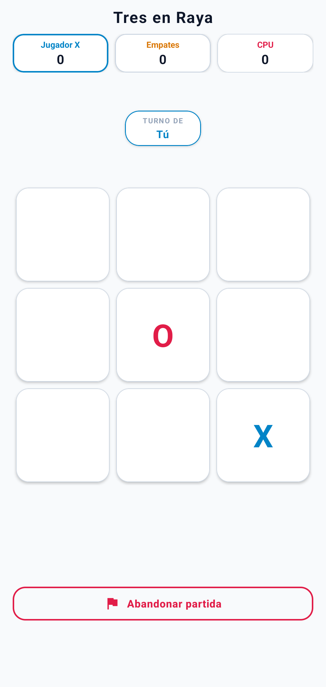
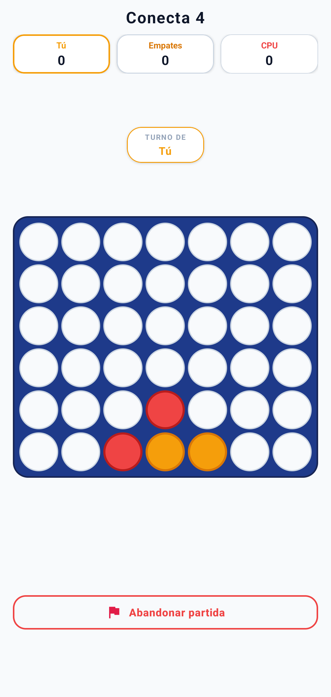
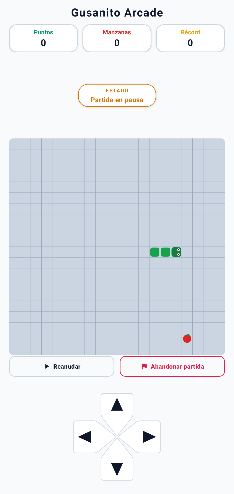
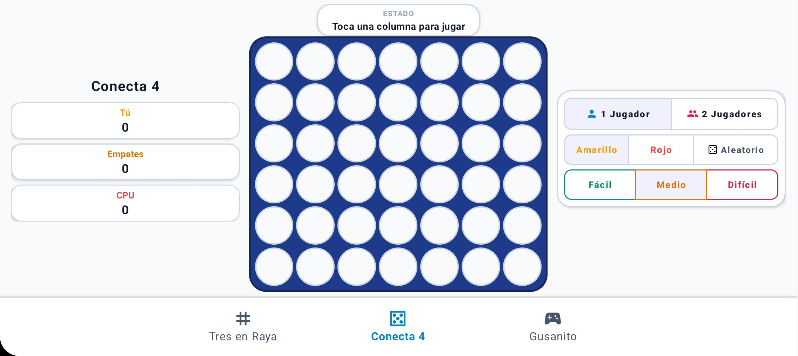

# GameHub

Suite de minijuegos clásicos y arcade para Android desarrollada como proyecto de software interactivo.

> **Aviso:** este proyecto tiene fines recreativos y educativos. Implementa motores de juego independientes, algoritmos de inteligencia artificial (Minimax y evaluación heurística), renderizado en Canvas 2D y persistencia local sin dependencias externas.

## Descripción

La aplicación es un centro de entretenimiento clásico y arcade para Android que reúne tres juegos legendarios totalmente reconstruidos con diseño moderno, animaciones fluidas y soporte completo tanto en orientación vertical como horizontal: **Tres en Raya (Tic-Tac-Toe)**, **Conecta 4 (Connect Four)** y **Gusanito Arcade (Snake)**. Incluye modalidades de 1 Jugador contra la inteligencia artificial (con múltiples niveles de dificultad ajustados algorítmicamente) y 2 Jugadores en el mismo dispositivo, marcadores de récord persistentes, tres esquemas de control ergonómicos y un motor gráfico optimizado para 60 FPS.

## Capturas de pantalla

<table align="center">
  <tr>
    <td align="center" width="33%">
      <br>
      <em>Imagen 1. Tres en Raya</em>
    </td>
    <td align="center" width="33%">
      <br>
      <em>Imagen 2. Conecta 4</em>
    </td>
    <td align="center" width="33%">
      <br>
      <em>Imagen 3. Gusanito Arcade</em>
    </td>
  </tr>
  <tr>
    <td align="center" colspan="3">
      <br>
      <br>
      <em>Imagen 4. Optimización responsiva en horizontal</em>
      <br>
    </td>
  </tr>
</table>

## Características

Incluye funciones para:

- **Tres en Raya (Tic-Tac-Toe)**:
  - Modos de juego: 1 Jugador contra la CPU y 2 Jugadores local en el mismo dispositivo.
  - Tres niveles de dificultad con IA progresiva: Fácil (movimientos aleatorios), Medio (bloqueo táctico y detección de victoria inmediata) y Difícil (algoritmo Minimax óptimo e invencible).
  - Elección de ficha inicial (X, O o sorteo aleatorio).
  - Animaciones elásticas de colocación (*pop-in*), resaltado de celdas ganadoras y vibración háptica.
- **Conecta 4 (Connect Four)**:
  - Tablero vertical clásico de 7 columnas por 6 filas con detección vectorial de 4 en línea (horizontal, vertical y diagonales).
  - Animación física de caída gravitacional de fichas con rebote (*BounceInterpolator*).
  - Modos 1 Jugador y 2 Jugadores con selector de ficha (Amarillo, Rojo o Aleatorio).
  - IA estratégica con evaluación posicional de amenazas futuras y bloqueo defensivo.
- **Gusanito Arcade (Snake)**:
  - Motor gráfico fluido renderizado en vista personalizada sobre Canvas 2D a 60 FPS.
  - Modos de juego: *Con bordes* (muerte por colisión en pared) y *Sin bordes* (efecto envolvente *wrap-around*).
  - Tres niveles de velocidad: Fácil, Medio y Difícil.
  - Aparición de manzanas normales y manzanas doradas de bonificación (*Golden Apples*) por tiempo limitado.
  - Tres esquemas de control arcade intercambiables y persistentes:
    - **Palanca virtual (Joystick)**: Gate estricto de 4 vías sin diagonales, delimitación anti-recorte y retorno elástico.
    - **Cruceta direccional (D-Pad)**: Botones táctiles optimizados con dibujo vectorial.
    - **Touchpad (Gestos continuos)**: Reconocimiento de deslizamiento continuo y *swipes* rápidos con alta respuesta.
- **Arquitectura y Experiencia General**:
  - Soporte responsivo completo en orientación vertical (*Portrait*) y horizontal (*Landscape*) con retención total de estado ante rotaciones de pantalla.
  - Marcadores y récords máximos (*High Score*) almacenados localmente de forma independiente por modo y dificultad mediante `SharedPreferences`.
  - Cancelación inmediata de procesos de IA y corrutinas al abandonar partidas para garantizar tableros limpios.
  - Transiciones animadas con Material Components y diseño minimalista en tema oscuro y claro.
  - Modo offline 100% funcional sin necesidad de conexión a Internet ni servicios externos.

## Tecnologías

- Kotlin.
- Android Studio.
- AndroidX y Material Components 3.
- View Binding.
- Custom Views (Canvas 2D y gráficos vectoriales dinámicos).
- Kotlin Coroutines para el bucle de juego y temporizadores de IA.
- SharedPreferences para persistencia de marcadores y preferencias.
- JUnit 4 para pruebas unitarias de motores y algoritmos.

## Requisitos

- Android Studio Iguana (2023.2.1) o superior.
- JDK 17 o superior (incluido en Android Studio).
- Android SDK con soporte para `compileSdk 37` y `minSdk 24` (Android 7.0 o superior).
- Dispositivo físico o emulador con Android 7.0 o superior.

## Ejecución del proyecto

1. Clonar el repositorio:
   ```bash
   git clone https://github.com/wTavo/Game-Hub.git
   ```
2. Abrir Android Studio y seleccionar **Open**.
3. Navegar hasta la carpeta clonada y seleccionarla.
4. Esperar a que Gradle sincronice todas las dependencias del proyecto.
5. Seleccionar un emulador o dispositivo físico conectado.
6. Presionar el botón **Run** (`Shift + F10`) para compilar e instalar la aplicación.

## Pruebas y compilación

- Para ejecutar las pruebas unitarias locales:
  ```bash
  ./gradlew test
  ```
- Para compilar el APK en modo Debug:
  ```bash
  ./gradlew assembleDebug
  ```
- Para compilar el APK en modo Release:
  ```bash
  ./gradlew assembleRelease
  ```

## Estructura del proyecto

```text
java/com/example/gamehub/
├── core/
│   └── animations/
│       └── GameAnimations.kt        # Gestor de animaciones elásticas, overlays y transiciones
├── games/
│   ├── connectfour/
│   │   ├── data/
│   │   │   └── ConnectFourScoreManager.kt        # Persistencia de marcadores de Conecta 4
│   │   ├── domain/
│   │   │   ├── ai/
│   │   │   │   └── ConnectFourAI.kt        # Inteligencia artificial heurística de Conecta 4
│   │   │   └── ConnectFourEngine.kt        # Motor de reglas y comprobación de 4 en línea
│   │   ├── model/
│   │   │   ├── ConnectFourCell.kt        # Modelo de celda en matriz
│   │   │   ├── ConnectFourDifficulty.kt        # Enumeración de dificultades (Fácil, Medio, Difícil)
│   │   │   ├── ConnectFourGameMode.kt        # Modos de juego (1 Jugador vs CPU, 2 Jugadores)
│   │   │   ├── ConnectFourGameState.kt        # Estados de partida (Idle, Playing, Won, Draw)
│   │   │   ├── ConnectFourPiece.kt        # Fichas del juego (Amarillo, Rojo)
│   │   │   └── ConnectFourWinningResult.kt        # Resultado de victoria y celdas ganadoras
│   │   └── ui/
│   │       └── ConnectFourFragment.kt        # Controlador de interfaz, tablero 7x6 y animaciones
│   ├── snake/
│   │   ├── data/
│   │   │   └── SnakeScoreManager.kt        # Persistencia de récord histórico y esquema de control
│   │   ├── domain/
│   │   │   └── SnakeEngine.kt        # Motor discreto de cuadrícula, buffer de entrada y colisiones
│   │   ├── model/
│   │   │   ├── SnakeDifficulty.kt        # Dificultades y velocidades del gusanito
│   │   │   ├── SnakeDirection.kt        # Direcciones cardinales y esquema de control
│   │   │   ├── SnakeFood.kt        # Modelos de manzana estándar y manzana dorada
│   │   │   ├── SnakeGameMode.kt        # Modos Con bordes y Sin bordes
│   │   │   ├── SnakeGameState.kt        # Estados de partida (Idle, Running, Paused, GameOver)
│   │   │   └── SnakePosition.kt        # Coordenada en la cuadrícula del juego
│   │   └── ui/
│   │       ├── SnakeDpadView.kt        # Vista táctil personalizada para cruceta D-Pad
│   │       ├── SnakeFragment.kt        # Controlador de la vista de Snake, bucle de juego y menú
│   │       ├── SnakeGameBoardView.kt        # Renderizador gráfico en Canvas 2D a 60 FPS
│   │       └── SnakeJoystickView.kt        # Palanca virtual de 4 vías en Canvas con retorno elástico
│   └── tictactoe/
│       ├── data/
│       │   └── ScoreManager.kt        # Persistencia de puntuaciones de Tres en Raya
│       ├── domain/
│       │   ├── ai/
│       │   │   ├── AIPlayer.kt        # Selector de jugadas por dificultad
│       │   │   └── MinimaxAlgorithm.kt        # Algoritmo Minimax invencible para IA
│       │   └── TicTacToeEngine.kt        # Motor de reglas y evaluación de 3 en raya
│       ├── model/
│       │   ├── CellPosition.kt        # Coordenadas de casilla en cuadrícula 3x3
│       │   ├── Difficulty.kt        # Niveles de IA (Fácil, Medio, Difícil)
│       │   ├── GameMode.kt        # Modos de juego (1 Jugador vs IA, 2 Jugadores)
│       │   ├── GameState.kt        # Estados de partida (Idle, Playing, Won, Draw)
│       │   ├── Player.kt        # Jugadores y símbolos (X, O)
│       │   ├── PlayerSymbolChoice.kt        # Preferencia de ficha (X, O, Aleatorio)
│       │   └── WinningResult.kt        # Resultado ganador y alineación de casillas
│       └── ui/
│           └── TicTacToeFragment.kt        # Controlador del tablero 3x3, eventos y efectos
└── MainActivity.kt        # Actividad principal contenedora y barra de navegación inferior
```